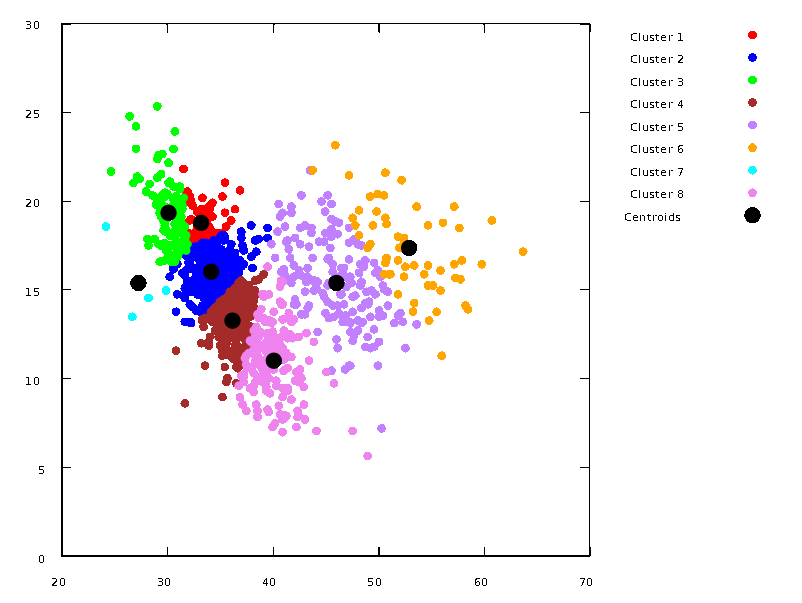
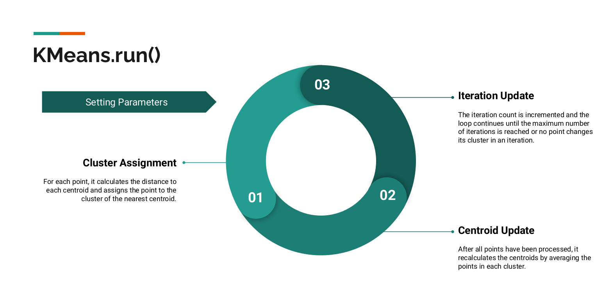
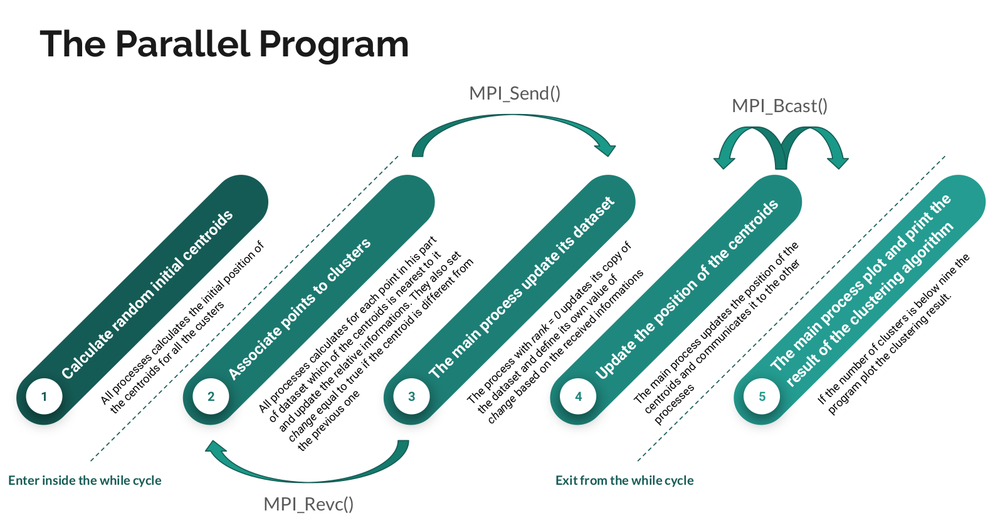

# MPI Parallel K-means implementation
This project is an implementation of the K-Means clustering algorithm in C++. It reads data from CSV files, performs K-Means clustering on the data, and generates an animation of the clustering process.

## Prerequisites
In order to be able to compile and run the program there are a few programs that need to be installed.
### mk modules
- Needed in order to use the gnuplot-iostream library
- Follow the instructions at the end of this README

### Gnuplot
- Needed to plot the graph of clusters
- Refer to the official website http://www.gnuplot.info/

## Getting Started
To compile the project, navigate to the project  root directory in your terminal and run the following commands:

```bash
module load gcc-glibc  #if not already loaded
module load boost  #if not already loaded

make
```
This will compile the source files and link them into an executable named <kbd>exe</kbd> that will be created in the project root folder.


You then run the <kbd>exe</kbd> with
```bash
mpirun -n num_of_processes ./exe
```
set num_of_processes as you prefer


## What to expect
When running the program, there are a few limitations to keep in mind:

1. The program currently supports reading and processing only CSV files with two features. If you have a different number of features in your CSV file, the program may not work as expected.

2. The program uses the Gnuplot library to generate visualizations of the clusters. However, please note that the program will only generate plots for up to 8 clusters. If you set the number of clusters (k) to a value greater than 8, the program will only print the cluster information on the terminal without generating any plots.

Please ensure that your CSV files have two features and consider setting the number of clusters within the limit of 8 to get the desired visualizations.


## Project Structure
The project is organized as follows:
* Files/: This directory contains the CSV files that are used as input data for the program. The provided files are Precolombian.csv and profiling.csv.

* IMG/: This directory contains the images that are generated by the program to visualize the clustering process. These images are used to construct the animation.

* include/: This directory contains the header files for the project. These define the classes and functions that are used in the program.

* src/: This directory contains the source files for the project. These implement the classes and functions that are defined in the header files.

The project also includes a Makefile for compiling and linking the program, and a .gitignore file for specifying which files and directories should be ignored by Git.

## Algorithm
The K-Means clustering algorithm works as follows:

1. Initialize k centroids randomly by selecting k points from the input data.
2. Assign each point to the cluster whose centroid is nearest.
3. Update the centroids based on the points assigned to each cluster.
4. Repeat steps 2 and 3 until no point changes its cluster assignment or the maximum number of iterations is reached.

The algorithm is implemented in the KMeans class, which is defined in include/kMeans.hpp and implemented in src/kMeans.cpp. The KMeans class also includes methods for printing the clusters and for generating a plot of the clusters using the Gnuplot library.



## Sequential 
Brief representation of the sequential algorithm implemented

## Parallel
How the logic of the algorithm changes in order to be parallelized with MPI 


## Authors
Leonardo Ignazio Pagliochini - Francesco Rosnati - Riccardo Selis


# MK MODULES
## What are mk modules?

[mk modules](https://github.com/pcafrica/mk) bundle a set of scientific libraries compiled under the same toolchain. Once installed, they provide the command module, that has several subcommands:

```
module load <module name> 
```

loads the requested module. This creates a set of environment variables storing relevant paths for that library (e.g. `mkEigenPrefix`, `mkEigenInc`, ...). Use

- `env | grep mk`  to obtain a list of all the environment variables relative to mk modules
- `module list`: to show a list of currently loaded modules
- `module avail`: to show a list of all available modules (loaded or not)
- `module --help`: to show a list of all the commands

## Installation
The mk modules are natively available **only for (reasonably modern) Linux distributions**.

### Download and install the modules

1. Download `mk-2022.0-full.tar.gz` from [this link](https://github.com/pcafrica/mk/releases/download/v2022.0/mk-2022.0-full.tar.gz). E.g.
```bash
wget https://github.com/pcafrica/mk/releases/download/v2022.0/mk-2022.0-full.tar.gz
```
2. `sudo tar xvzf mk-2022.0-full.tar.gz -C /` (~ 4.5GB required).

To load them you should type each time you open the terminal `source /u/sw/etc/bash.bashrc`. However you can add the following lines to the `${HOME}/.bashrc` file (or equivalent) to have them always loaded:
```bash
# mk.
source /u/sw/etc/bash.bashrc
module load gcc-glibc/11.2.0
module load eigen tbb
```

Complete user guide available [here](https://lmod.readthedocs.io/en/latest/010_user.html).
